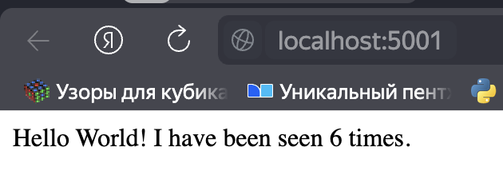
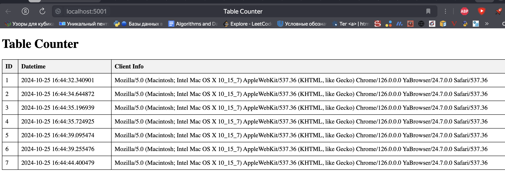

# small-flask-app

```bash
docker compose -p flask-app up -d
```

## Res



## Table



## Инструкция по развертыванию

### 1. Установка Docker и Docker Compose

Убедитесь, что Docker и Docker Compose установлены на вашей машине:
- [Docker](https://docs.docker.com/get-docker/)
- [Docker Compose](https://docs.docker.com/compose/install/)

### 2. Сборка и запуск контейнеров

1. **Сборка контейнеров:**
   ```bash
   docker-compose build
   ```

2. **Запуск контейнеров:**
   ```bash
   docker-compose -p small-flask-app up -d 
   ```

### 3. Остановка контейнеров

Чтобы остановить контейнеры, выполните команду:
```bash
docker-compose -p small-flask-app down
```
